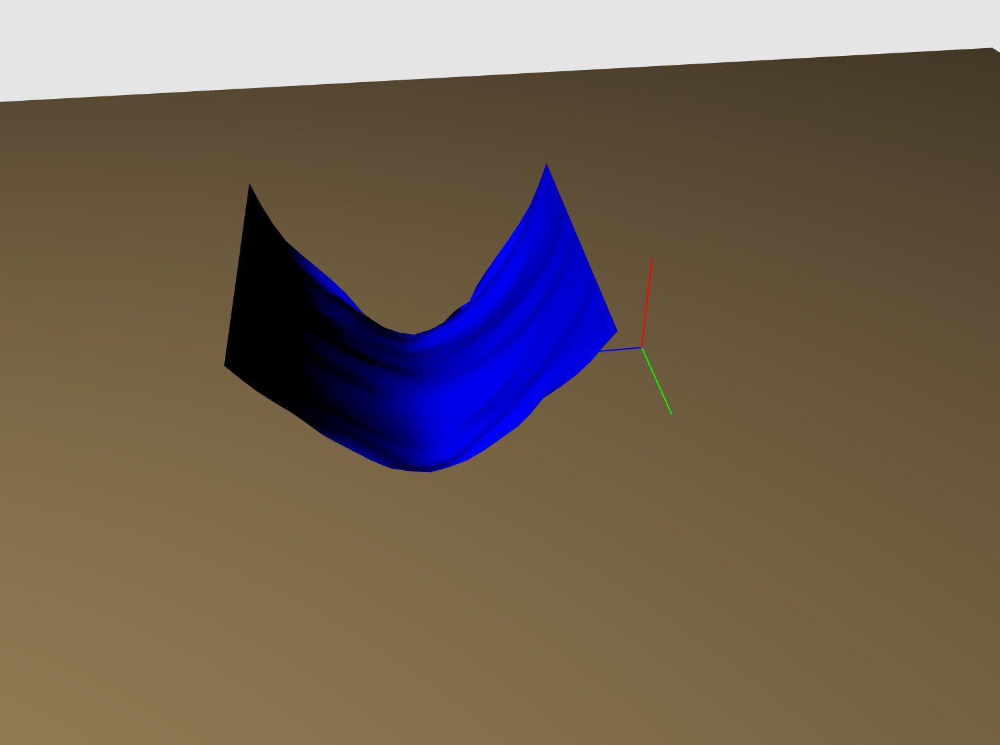
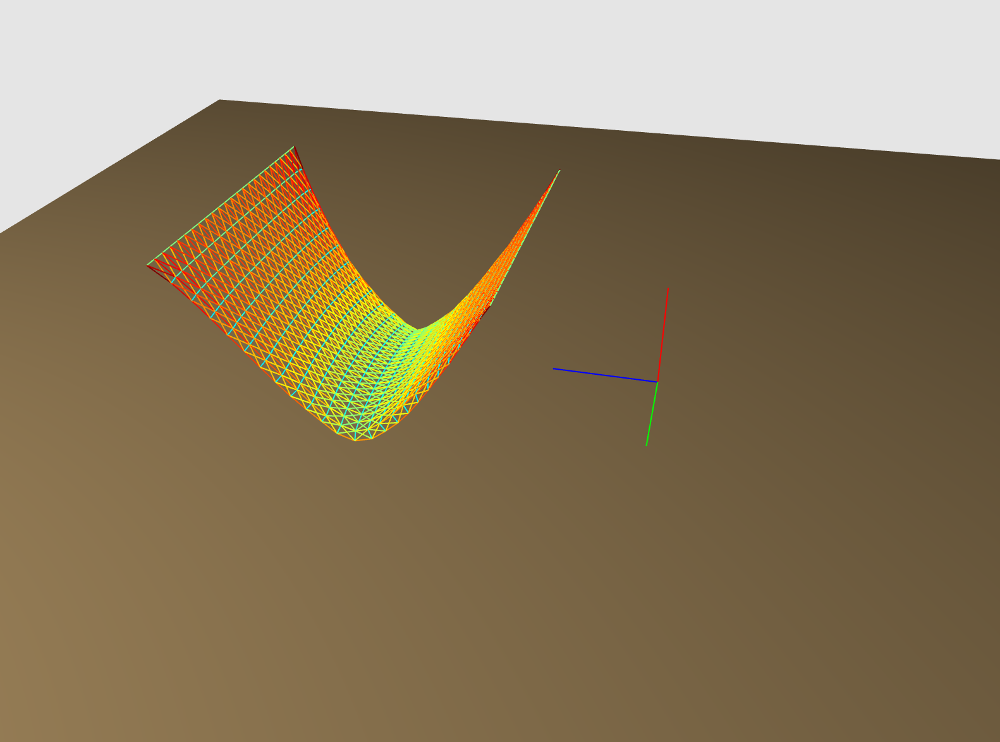
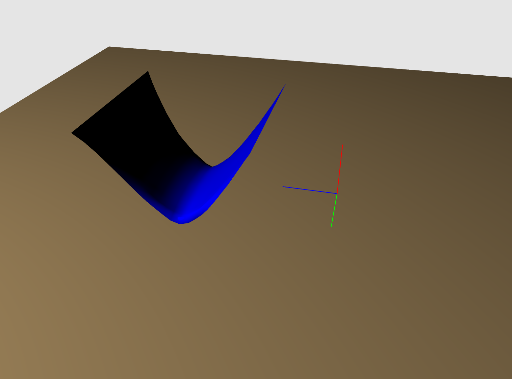
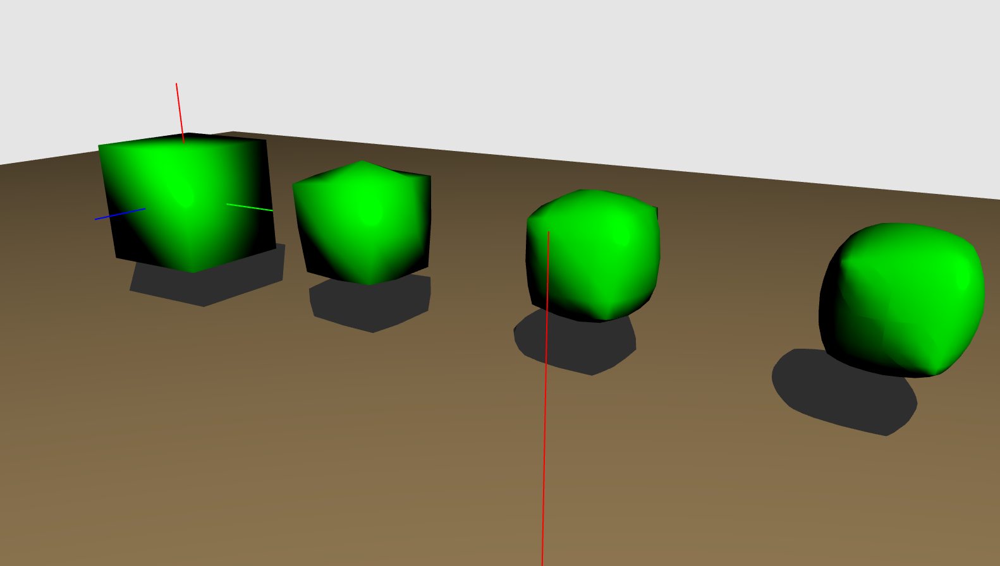
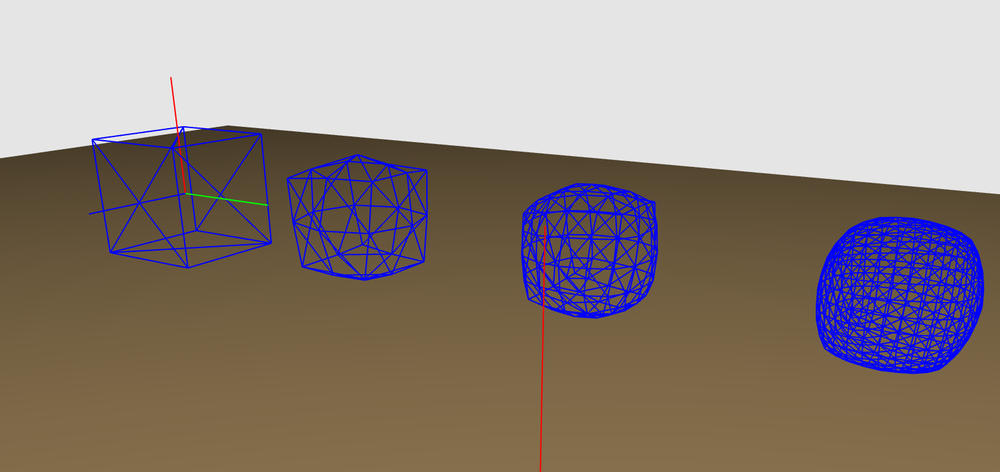

## Graphics Experiments

### Cloth Simulation

References used were Physical Systems Chapter 8 (Deformable Springy Meshes) and Large Steps in Cloth Simulation (Baraff, Witkin ACM SIGGRAPH 1998).

Very naive cloth simulation with gravity and damping.

Cloth consists of N x N cell grid of masses (represented by spheres) that are connected to every direct neighbor.

Velocity updates are done through integrating acceleration (forward Euler).

Rendering is done by creating quads in each grid cell and using Phong shading.

Energy side by side visualization.

### Boids Flocking Simulation

Implementation of Craig Reynolds paper in ACM SIGGRAPH 1987 that simulates how birds and other artificial life moves.

Movement is based on a couple factors -

* "Leader" of the herd.
* Center of flocking mass.
* Proximity to neighbors.
* Presense of food.
* Random.

### Mesh Smoothing (Loop Subdivision)

This is a method for approximating the limit of a surface by Charles Loop in 1987 for triangular meshes.

Essentially, each triangle gets split into four triangles, and the vertices get moved around based on neighbor positions.

