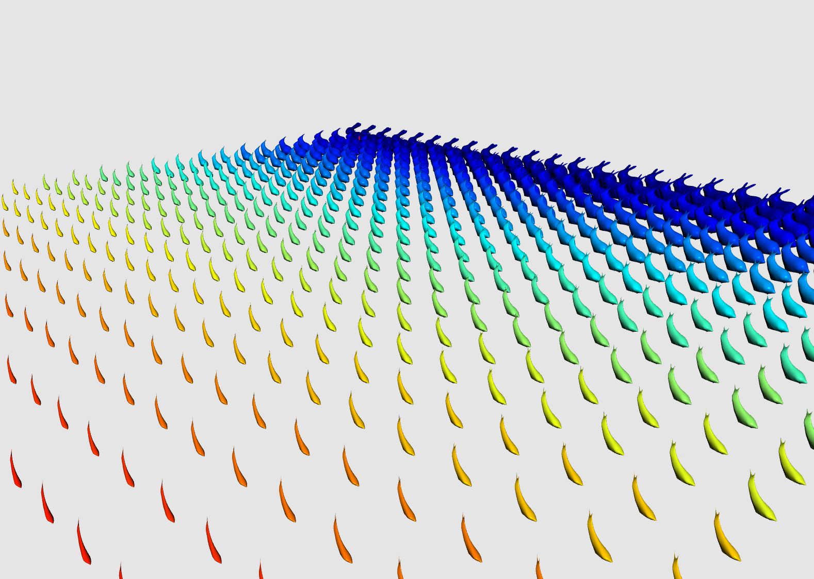
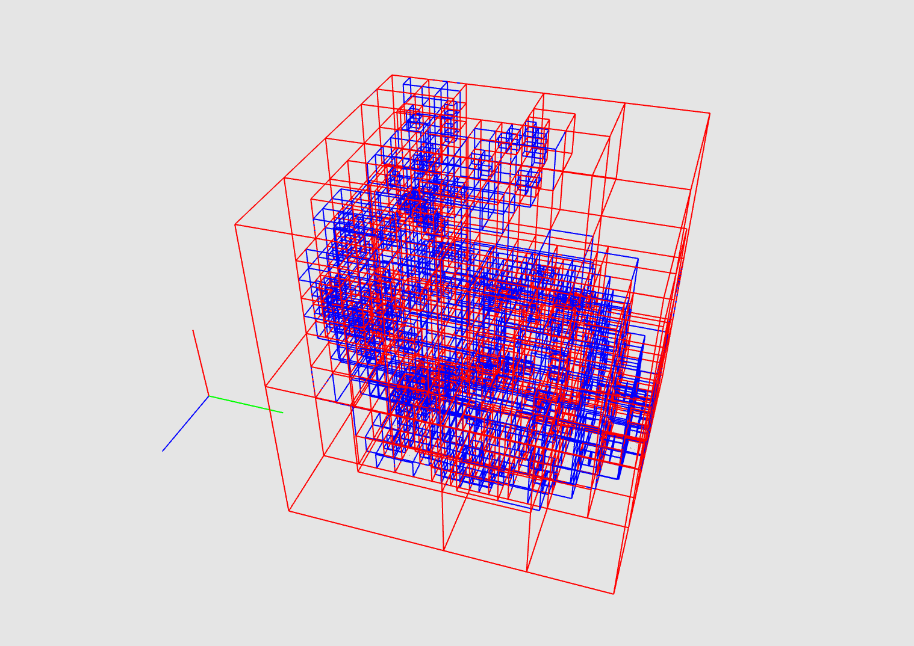

## Graphics Experiments

### Cloth Simulation

References used were Physical Systems Chapter 8 (Deformable Springy Meshes) and Large Steps in Cloth Simulation (Baraff, Witkin ACM SIGGRAPH 1998).

Very naive cloth simulation with gravity and damping.

Cloth consists of N x N cell grid of masses (represented by spheres) that are connected to every direct neighbor.

Velocity updates are done through integrating acceleration (forward Euler).

Rendering is done by creating quads in each grid cell and using Phong shading.

Energy side by side visualization.

### Boids Flocking Simulation

Implementation of Craig Reynolds paper in ACM SIGGRAPH 1987 that simulates how birds and other artificial life moves.

Movement is based on a couple factors -

* "Leader" of the herd.
* Center of flocking mass.
* Proximity to neighbors.
* Presense of food.
* Random.

### Mesh Smoothing (Loop Subdivision)

This is a method for approximating the limit of a surface by Charles Loop in 1987 for triangular meshes.

Essentially, each triangle gets split into four triangles, and the vertices get moved around based on neighbor positions.

### Particle Physics Engine

Basic implementation of particle physics using the penalty method.

Particles are represented as small masses and gravity, basic collisions with planes and other geometry primitives work.

TODO: add angular velocity and use spatial data structures to speedup collision detection.

### Laplacian Smoothing

This method moves every vertex to the average of its neighbors vertices (pretty naive).

This can be represented in matrix form as P_new = A * P_old, where P_new, P_old are N x 4 matrices (homogeneous coordinates), and A is N x N, sparse, symmetric positive definite which is the adjacency matrix of the mesh.

So we can see the first iteration of the smoothing is P_1 = A * P_0.

The second iteration is P_2 = A * P_1, which is P_2 = A * A * P_0.

The Kth iteration is P_k = A^k * P.

This seems like a job for doing an eigendecomposition of the adjacency matrix, but the matrix matrix multiplications were surprisingly fast, since a sparse matrix was used.

Using the eigendecomposition will be future work.

### Spatial Data Structures (Oct-Tree, BVH)

The octtree is a pretty elegant way to discretize a space into cells.

Each node has 8 children, which hold pointers to the objects that fall into the region covered by the node.

This input is a set of points that need to be partitioned spatially (hence the name).

The time complexity of construction is O(n * k), where k is the depth of the tree.

The number of nodes grows with O(8 ^ k), since each node has at max 8 children.

Currently, only construction and visualization is implemented.

TODO: collision queries and updates (addition/removal).

